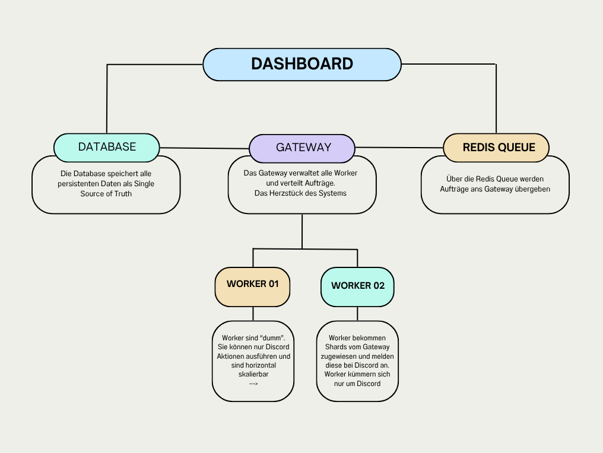
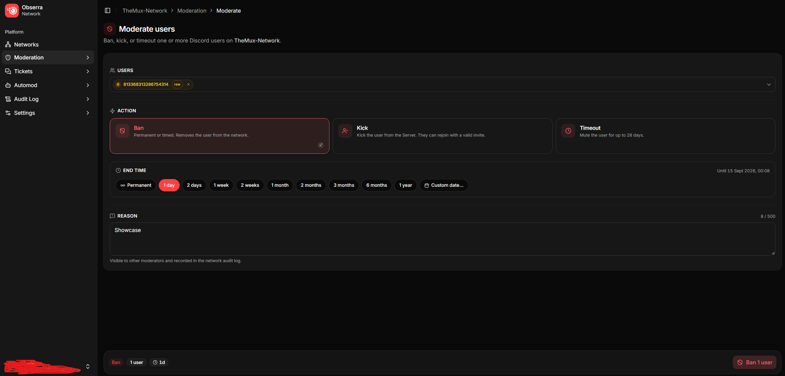
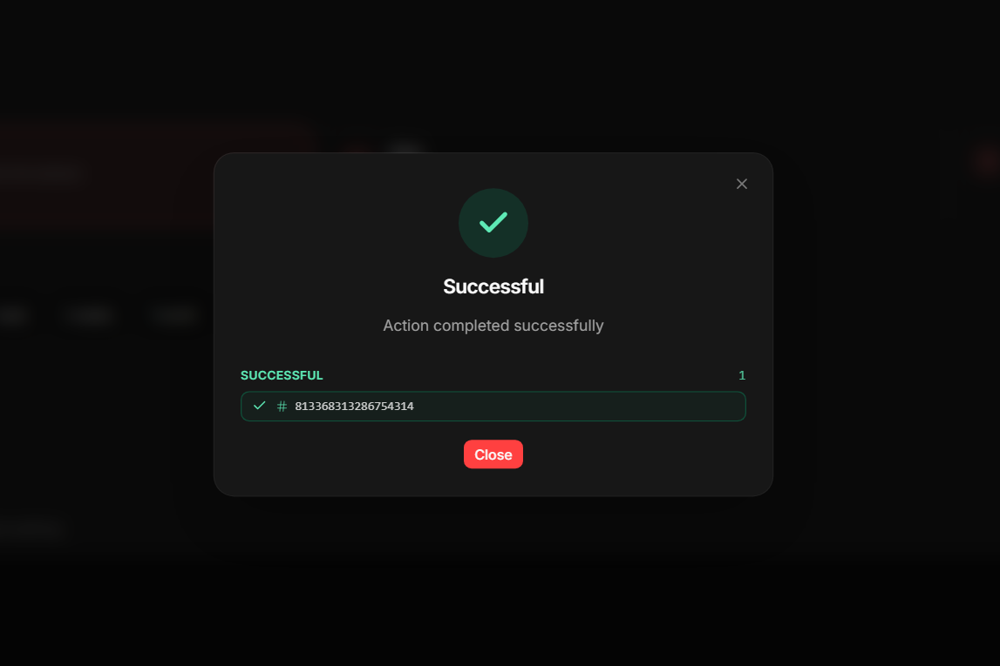
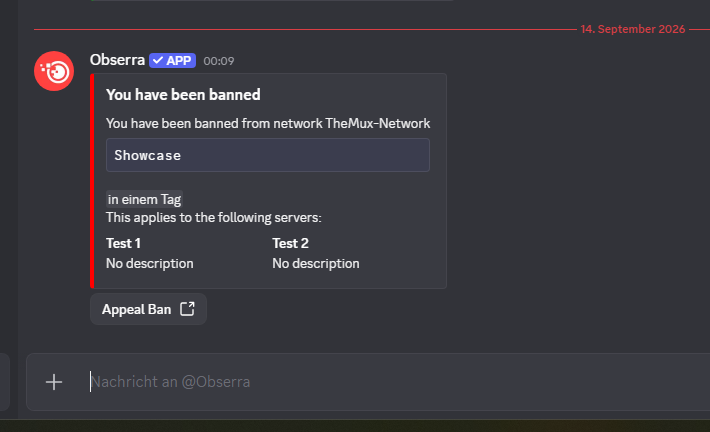

# Obserra – Verteiltes Moderationssystem für Discord

## Überblick

Obserra ist ein selbst entwickeltes, verteiltes Backend-System zur Verwaltung und Moderation von Discord-Servern.

Das System ermöglicht es, mehrere Server in Netzwerken zu organisieren und Moderationsregeln zentral zu definieren und automatisiert durchzusetzen. Dabei liegt der Fokus auf Skalierbarkeit, modularer Architektur und klarer Trennung von Verantwortlichkeiten innerhalb des Systems. Das System ermöglicht außerdem volle Kontrolle außerhalb von Discord per Web-Dashboard, welches von meinem Projektpartner [Theminemat](https://github.com/theminemat) erstellt wurde. 

## Zusammenarbeit

Das Web-Dashboard und die Datenbank wird von [Theminemat](https://github.com/theminemat) verwaltet und erstellt.

Meine Arbeit lag insbesondere im Backend-Bereich und der Discord Intergration einschließlich:
- Systemarchitektur und Umsetzung der Gateway- und Worker-Architektur
- Entwicklung des Discord-Bots
- Backend-Logik
- Kommunikation über Redis Queues
- API-Design und -Implementierung
- Datenbankanbindung und Infrastruktur
- Discord Intergration via Discord.net

Der Fokus dieses Repositories liegt aber auf der Backend-Architektur und Systemlogik.

## Technologien

- **C# / .NET 8**  
  Sprache des gesamten Systems  

- **ASP.NET Core**  
  Implementierung der REST-API  

- **Entity Framework Core**  
  Datenbankanbindung und Datenzugriff  

- **PostgreSQL (Npgsql)**  
  Persistente Speicherung von Daten  

- **Redis**  
  Queue-System für Aufgaben vom Dashboard zum Gateway  

- **Docker**  
  Containerisierung und Deployment der einzelnen Anwendungen

## Architektur

Obserra hat eine verteilte Architektur, bei der Aufgaben auf mehrere spezialisierte Anwendungen aufgeteilt sind:

- **Gateway**  
  Zentrale Instanz zur Koordination des Systems.  
  Nimmt Aufträge entgegen und verteilt diese über eine Queue an verfügbare und zuständige Worker.

- **Worker**  
  Führen konkrete Aufgaben aus (z. B. Moderation, Events) und sind bewusst einfach gehalten, um horizontal skalieren zu können.

- **Redis Queue**  
  Dient als Messaging-System zur asynchronen Verteilung von Aufgaben von Dashboard zu Gateway.

- **REST API**  
  Schnittstelle zur Kommunikation zwischen Gateway und Workern.

- **Datenbank (PostgreSQL)**  
  Speicherung von Konfigurationen, Serverdaten und Moderationsinformationen.

### Architektur Diagramm
---

## Datenfluss (vereinfacht)

1. Ein Auftrag wird über das Web-Dashboard erstellt
2. Das Gateway nimmt den Auftrag über die Redis-Queue an
3. Der Auftrag wird verarbeitet und das Gateway führt alle Aktionen verbunden mit diesem Endpunkt aus
4. Alle zuständigen Worker werden vom Gateway per REST-API beauftragt mit ihren spezifischem Part der Aktion
5. Ergebnisse gehen zurück ans Gateway und werden zusammengeführt
6. Das Gateway speichert Daten in der Datenbank
7. Gateway antwortet dem Dashboard per Redis-Queue

## Screenshots

### Moderationsauftrag erstellen
---

### Status Antwort erhalten
---

### Discord Bestätigung beim Ziel Nutzer
---

## Hinweis

Dieses Repository dient ausschließlich als technisches Showcase.  
Der vollständige Quellcode ist nicht öffentlich verfügbar.
